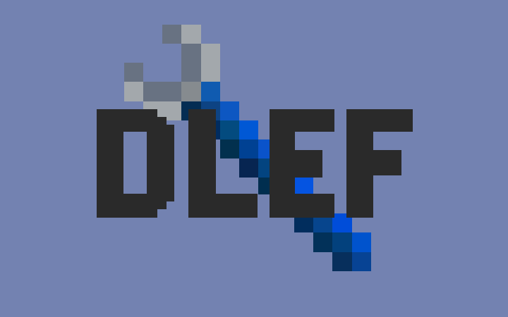

# Datapack Load Error Fix

**A comprehensive Minecraft world repair utility that fixes common issues caused by removed mods and datapacks.**

  

## Overview

Datapack Load Error Fix is a lightweight utility mod designed to help players recover and continue using their Minecraft worlds after removing mods. When mods that add custom dimensions, entities, or blocks are uninstalled, they often leave behind data references that can cause world loading errors or in-game crashes. This mod automatically detects and cleans these invalid references, allowing your worlds to load properly again.

## Features

- **Dimension Data Cleanup**: Removes references to dimensions from uninstalled mods in level.dat files
- **Entity Cleanup**: Scans and removes entities from removed mods in region files
- **Block Entity Repair**: Identifies and removes tile entities (like machines, chests, etc.) from uninstalled mods
- **Non-Intrusive Operation**: Works silently in the background when a world is loaded
- **Automatic Backups**: Creates backups of modified files for safety
- **Server Compatible**: Works on both client and server installations

## How It Works

When you load a world, the mod automatically:
1. Scans your level.dat file for dimension references
2. Checks region files for entities and block entities
3. Compares found references against your currently installed mods
4. Removes any references to mods that are no longer present
5. Creates backups of any modified files

## Usage

Simply install the mod and load your problematic world. No configuration needed! The mod will automatically detect and fix issues in the background.

For advanced users, detailed logs are available showing exactly what was removed or modified.

## Common Issues Fixed

- "Failed to load level.dat" errors after removing dimension mods
- Crashes when entering areas with entities from removed mods
- Performance issues caused by invalid entity references
- Missing blocks or corrupted chunks from uninstalled content mods

## Compatibility

Compatible with most Minecraft Forge versions. Does not modify gameplay mechanics or add any in-game content, making it compatible with virtually all other mods.

*Note: Always back up your worlds before using any repair tools, even though this mod creates its own backups automatically.*

